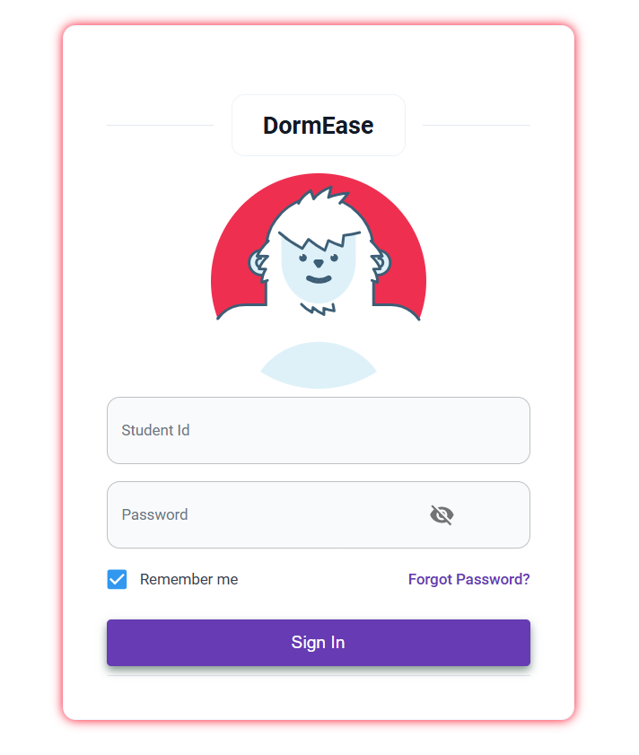
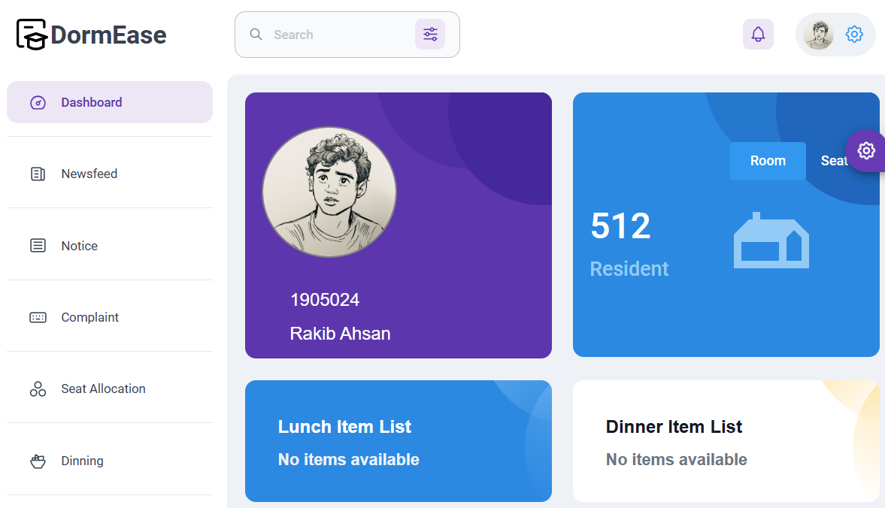
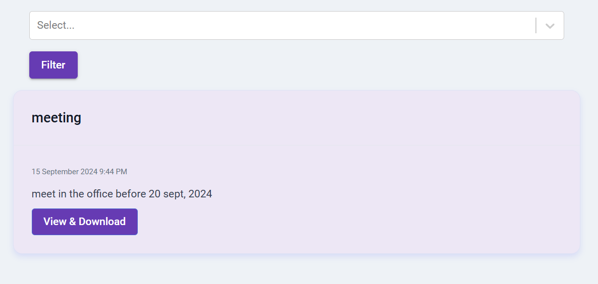
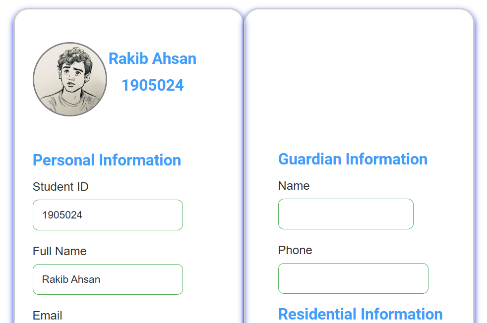
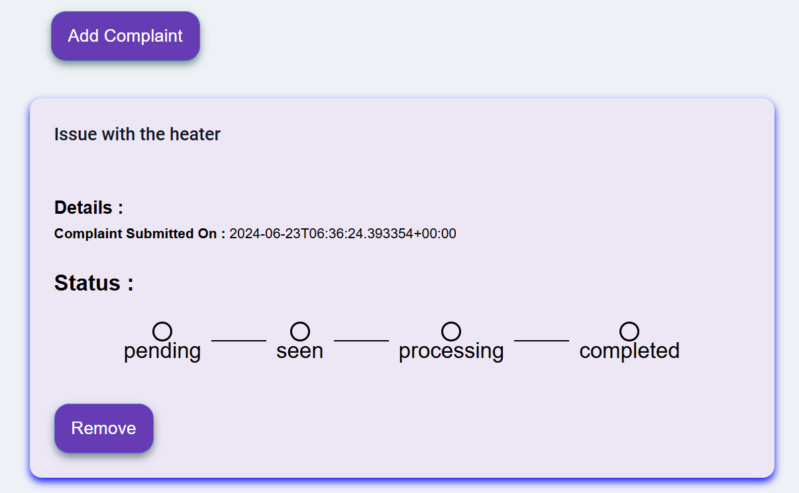
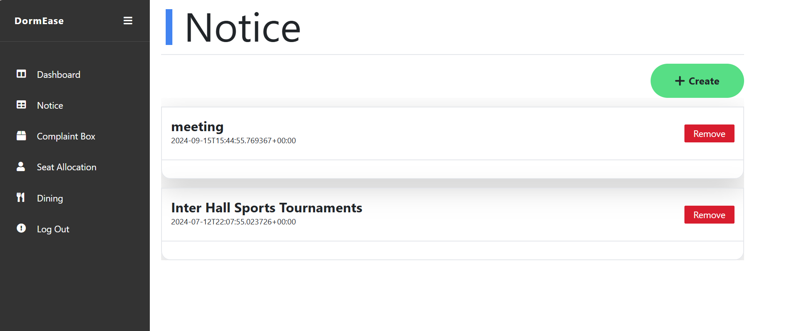
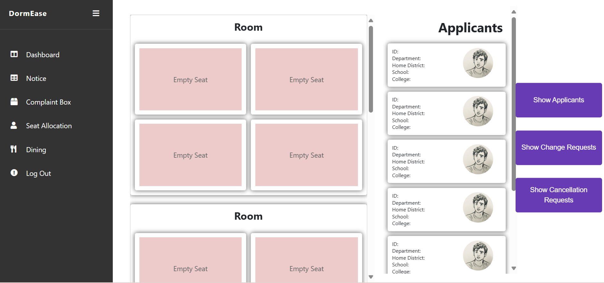

# DormEase  

DormEase is a web platform designed to simplify managing hall operations. It helps students and hall authorities stay connected and easily handle daily tasks.  

Youtube Link: [here](https://youtu.be/5yHGhPkHLYI?si=smDduKCGdDzLPtOj)

Architecture:
---
Model-View-Controller architecture

Tech Stack & Tools:
---
- Frontend: <code>React</code>, <code>HTML</code>, <code>CSS</code>
- Backend: <code>node js</code>, <code>express js</code>
- Database: <code>PostgreSQL</code>
- multipart/form-data: <code>multer</code>
- API documentation: <code>swagger-jsdoc</code>, <code>swagger-ui-express</code>
- API testing: <code>postman</code>

## Features  

1. **Newsfeed for Students**  
   - Keep students updated with hall news and events.  
   - Share important updates like cultural programs, maintenance schedules, and more.  

2. **Notice Board**  
   - Share public announcements for all students, like exam schedules or event details.  
   - Send private notices to specific students or groups for important matters.  

3. **Seat Allocation**  
   - Students can see available seats, apply for them, and check their application status.  
   - Authorities can manage and assign seats transparently.  

4. **Complaint Management**  
   - Students can report issues (e.g., broken furniture, maintenance problems) directly through the platform.  
   - Complaints are organized for quick action, and students can track the resolution process.  

5. **Dining Coordination**  
   - Plan meal options and manage meal schedules efficiently.  
   - Track attendance and ensure smooth dining operations for everyone.
     
DormEase is built to create a better experience for dorm students and make hall management stress-free for authorities.  

## Things to do after pulling or cloning

- For backend

  1. Go to the `Backend` directory and install dependencies by
     
     ```
     cd Backend
     npm install
     ```
     
  3. Now start the server by
     
     ```
     npm start
     ```
     
     Now the Backend server will be available at `localhost:3000`

- For frontend (student)

  1. Go to the `create-react-app` directory and install dependencies by

     ```
     cd create-react-app
     npm install
     ```

  2. Now start the server by
     
     ```
     npm start
     ```
     
     Now the frontend server will be available at `localhost:3001`

- For frontend (admin)

  1. Go to the `admin_side` directory and install dependencies by

     ```
     cd admin_side
     npm install
     ```

  2. Now start the server by
     
     ```
     npm start
     ```
     
     Now the frontend server will be available at `localhost:3002`


# some pages of this project are shown 
>
>login page (student end)
>
>
>
>dashboard Page (student end)
>
>
> 
>notice page (student end)
>
>
>
>view profile page (student end)
>
>
>
>complain profile page (student end)
>
>
>
>notice page (admin end)
>
>
>
>seat allocation page (admin end)
>
>
